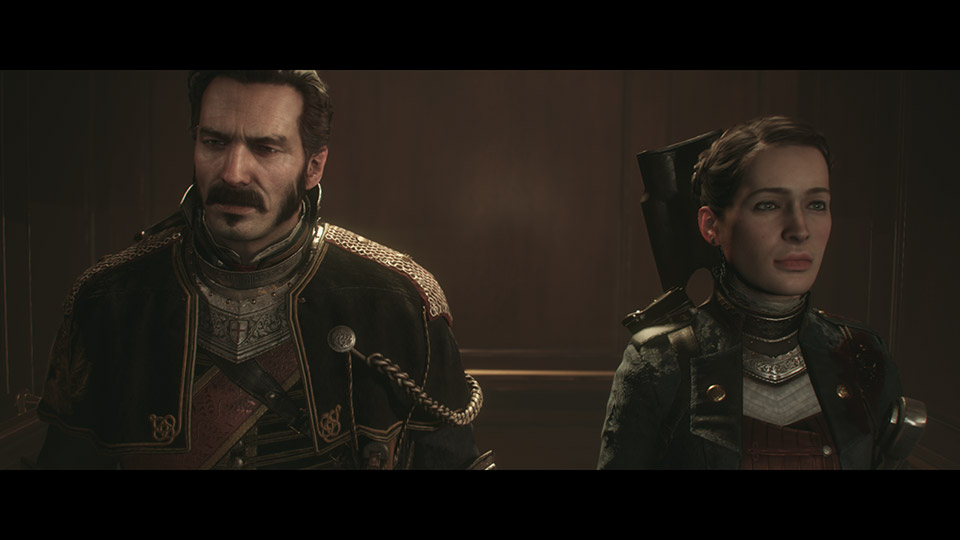

# Letterboxing

Letterboxing is the process of changing an image or video's aspect ratio to another format while preserving the original aspect ratio. The resulting image has mattes (black bars) above and below it. The **UI Toolkit** packages includes a [Letterboxing](/api/Zigurous.UI/Letterboxing) script to handle this process. This script is most useful when displaying in-game cutscenes to give it a more cinematic feeling.

## 🎞️ Cinematic Bars

Also included in the **UI Toolkit** package is the script [CinematicBars](/api/Zigurous.UI/CinematicBars) which allows you to simulate the letterboxing effect without actually changing the camera's viewport. This script displays the mattes (black bars) as UI elements overlayed in screen space.

The color and material of the mattes can be customized as well as the desired aspect ratio. The script will animate the mattes in and out simply by enabling or disabling the script.
